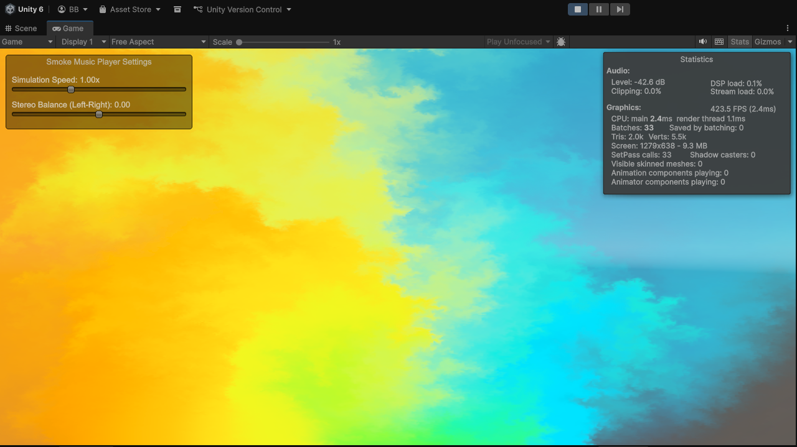
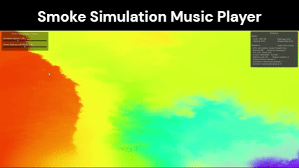
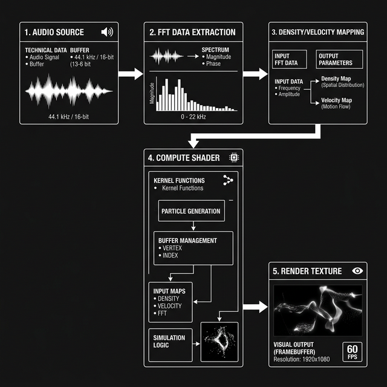

# Smoke Music Player



Smoke Music Player is a dynamic 2D audio visualizer built in Unity. It uses real-time FFT (Fast Fourier Transform) analysis to drive a fluid simulation (smoke), creating an immersive and interactive music experience.



## Features

- **Real-time Audio Visualization**: Supports `.mp3`, `.wav` files, and live **Microphone Input**.
- **Live Mode**: Analyze audio silently from any connected microphone device with adjustable sensitivity.
- **Improved UI/UX**: Professional tabbed interface for easier navigation and control.
- **Fluid Simulation**: Powered by GPU Compute Shaders for high performance (60+ FPS).
- **Interactive Smoke**: Influence the smoke density and velocity with mouse drag interactions.
- **Customizable Presets**: Adjust simulation parameters (viscosity, speed, stereo drift) and save/load your favorite configurations.

## Project Architecture

The project follows a modular pipeline designed for real-time responsiveness and high-performance GPU simulation.

### Data Flow Pipeline



The system operates in a continuous loop:
1.  **Audio Analysis**: `AudioManager` extracts raw spectral data using FFT or manual buffer sampling for live inputs.
2.  **Mapping**: `AppController` maps frequency bands (Bass/Mid/High) to physical fluid properties like density, velocity, and color.
3.  **Simulation Step**: The `IFluidSolver` calculates the next state of the grid based on Navier-Stokes equations.
4.  **Rendering**: The final density grid is displayed via a custom shader on a 2D quad.

## Getting Started

### Prerequisites

- [Unity 2020.2.10f1](https://unity3d.com/get-unity/download/archive) or newer.
- A GPU with Compute Shader support is recommended.

### Installation

1. **Clone the Repository**:
   ```bash
   git clone https://github.com/RagnarokFate/SmokeMusicPlayer.git
   ```
2. **Open in Unity**:
   - Open Unity Hub.
   - Click **Add** and select the cloned folder.
   - Open the project with the correct Unity version.

## Usage Guide

1. **Audio Sources (Audio Tab)**: 
   - **File Mode**: Load a `.wav`/`.mp3` file for playback and visualization.
   - **Live Mode**: Switch to **Microphone** mode and select your device. Use the **Live Sensitivity** slider to boost quiet inputs.
2. **Simulation Controls (Simulation Tab)**: 
   - **Simulation Speed**: Adjust how fast the fluid simulation evolves (0.5x to 2.0x).
   - **Stereo Balance**: Control the horizontal drift bias of the smoke.
   - **Viscosity**: Tweak the "thickness" of the fluid.
3. **Presets (Presets Tab)**:
   - Save your current settings or load the default profile.
   - Toggle **Debug Stats** to see real-time FPS and grid data.
4. **Interact**: Click and drag your mouse across the visualization window to disturb the smoke.

## License

MIT License - see the [LICENSE](LICENSE) file for details.

## Credits

Developed by RagnarokFate.
Inspired by Jos Stam's Stable Fluids algorithm.
