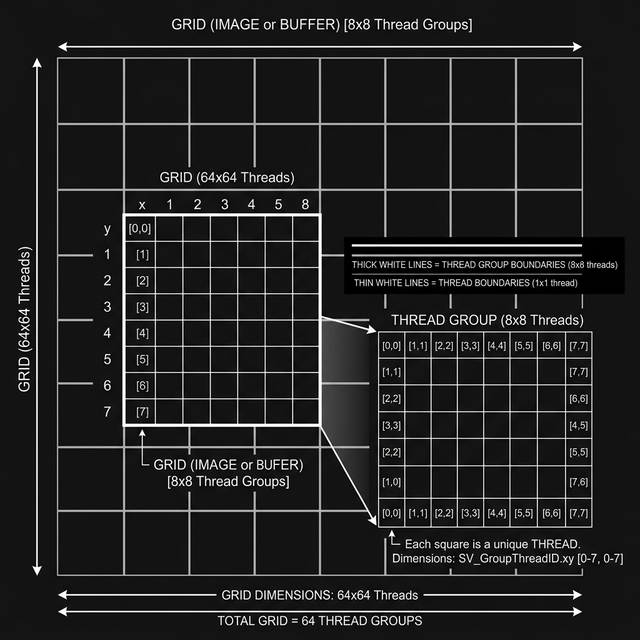

# Smoke Music Player


Smoke Music Player is a dynamic 2D audio visualizer built in Unity. It uses real-time FFT (Fast Fourier Transform) analysis to drive a fluid simulation (smoke), creating an immersive and interactive music experience.


## Features

- **Real-time Audio Visualization**: Supports `.mp3`, `.wav` files, and live **Microphone Input**.
- **Live Mode**: Analyze audio silently from any connected microphone device.
- **Fluid Simulation**: Powered by GPU Compute Shaders for high performance (60+ FPS).
- **Interactive Smoke**: Influence the smoke density and velocity with mouse drag interactions.
- **Customizable Presets**: Adjust simulation parameters (viscosity, diffusion, color) and save/load your favorite configurations.
- **Cross-Platform Support**: Optimized for Windows Standalone with a CPU-based fallback for older hardware.

## Project Architecture

The project follows a modular pipeline designed for real-time responsiveness and high-performance GPU simulation.

### Data Flow Pipeline


The system operates in a continuous loop:
1.  **Audio Analysis**: `AudioManager` extracts raw spectral data using FFT.
2.  **Mapping**: `AppController` maps frequency bands (Bass/Mid/High) to physical fluid properties like density, velocity, and color.
3.  **Simulation Step**: The `IFluidSolver` (GPU or CPU) calculates the next state of the grid based on Navier-Stokes equations for stable fluids.
4.  **Rendering**: The final density grid is written to a `RenderTexture` and displayed via a custom shader on a 2D quad.

### GPU Compute Dispatching



To maintain 60+ FPS at high resolutions (512x512 grid), the simulation is split into concurrent thread groups on the GPU. Each cell's pressure, velocity, and density are updated in parallel using kernels defined in `FluidMath.compute`.

## Getting Started

### Prerequisites

- [Unity 2020.2.10f1](https://unity3d.com/get-unity/download/archive) or newer.
- A GPU with Compute Shader support is recommended for the best experience.

### Installation

1. **Clone the Repository**:
   ```bash
   git clone https://github.com/RagnarokFate/SmokeMusicPlayer.git
   ```
2. **Open in Unity**:
   - Open Unity Hub.
   - Click **Add** and select the cloned folder.
   - Open the project with the correct Unity version.

3. **Build or Run**:
   - Open the main scene located in `Assets/Scenes/`.
   - Press **Play** in the Unity Editor or go to **File > Build Settings** to create a standalone executable.

## Usage Guide

1. **Audio Sources**: 
   - **File Mode**: Load a `.wav`/`.mp3` file for playback and visualization.
   - **Live Mode**: Toggle the **Mode** button to switch to **LIVE** mode and select a microphone from the list. The smoke will react to ambient sound silently (no feedback).
2. **Playback & Simulation Controls**: 
   - **Speed Slider**: Adjust the simulation and playback speed (0.5x to 2.0x) using the on-screen slider.
   - **Stereo Balance**: Adjust the drift of the smoke to the left or right (-1.0 to 1.0) with the balance slider.
   - **Hotkeys**: Press `1` for 0.5x, `2` for 1.0x (normal), and `3` for 2.0x speed for quick changes.
3. **Interact**: Click and drag your mouse across the visualization window to disturb the smoke.
4. **Configure**: Use the settings panel to tweak the simulation:
   - **Viscosity**: Control how "thick" the smoke feels.
   - **Diffusion**: Control how fast the smoke spreads.
   - **Color Palette**: Choose different color schemes for the visualization.
5. **Save Presets**: Once you find a look you like, name and save your preset to access it later.

## License

This project is licensed under the MIT License - see the [LICENSE](LICENSE) file for details.

## Credits

Developed by RagnarokFate.
Inspired by Jos Stam's Stable Fluids algorithm.
